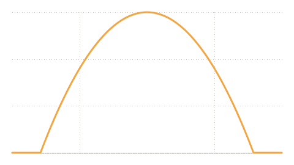

R1 is a ground radar. T3 is an aircraft eighty-eight kilometres away, flying on at 350 m/s. The beam stays where T3 was at the start. This notebook asks one question: does R1 detect T3?

<!-- skill: This notebook ports visuals/viz/radar-network, link R1 > R1:T3. Keep every number traceable to data/preset.json there. The controls start at the preset; the t = 0 assertions in "The budget" pin the preset's reference values whatever the controls say. If a parameter changes, recompute them from the reference, never loosen the tolerance. -->

<!-- skill: Narration lives in say blocks, one per chapter, written to be heard: short sentences, numbers rounded as spoken, no symbols. -->

## The link

One transmitter and one receiver share an antenna, so the pulse travels out and the echo travels back. The preset is synthetic, except the 10 GHz carrier; the controls start at it, and every chapter below follows them.

```toml
libm = "=0.2.16"
```

```rust
//| caption: The preset, and the link the controls make of it. Maths goes through `libm`, so this page and its build agree to the last bit.
use libm::{atan2, exp, lgamma, log, log10, pow, sqrt};
const C: f64 = 299_792_458.0; // m/s
const K: f64 = 1.380_649e-23; // J/K

/// R1's transmitter, antenna and detector, and T3's echo.
struct Link { f: f64, pt: f64, g0: f64, beam: f64, floor: f64, loss: f64, rcs: f64, ts: f64, tau: f64, pulses: f64, pfa: f64, pd_req: f64 }

let preset = Link { f: 10e9, pt: 100e3, g0: 30.0, beam: 10.0, floor: 30.0, loss: 6.0, rcs: 1.0, ts: 600.0, tau: 10e-6, pulses: 64.0, pfa: 1e-6, pd_req: 0.9 };
let link = Link {
    pt: slider("Transmit power (kW)", 10.0, 1000.0, 10.0, 100.0) * 1e3,
    rcs: slider("Target cross-section (m²)", 0.1, 10.0, 0.1, 1.0),
    pulses: slider("Pulses integrated", 1.0, 256.0, 1.0, 64.0),
    pfa: pow(10.0, -slider("False alarms, one in 10^n", 3.0, 10.0, 1.0, 6.0)),
    pd_req: slider("Required Pd", 0.5, 0.99, 0.01, 0.9),
    ..preset
};
let eta = -log(link.pfa);
println!("wavelength {:.4} m, threshold η = {eta:.4}", C / link.f);
```

```say
R one sends a hundred kilowatt pulse at ten gigahertz. Sixty four pulses add up coherently before it decides.
```

## Geometry

The beam is fixed on T3's starting point. As T3 flies, it drifts off the beam's axis and the gain falls: twelve decibels at the edge of the ten-degree beam, never more than thirty.

```rust
//| caption: Positions in metres, velocities in metres per second.
type V = [f64; 3];
fn at(p: V, v: V, t: f64) -> V { [p[0] + v[0] * t, p[1] + v[1] * t, p[2] + v[2] * t] }
fn sub(a: V, b: V) -> V { [a[0] - b[0], a[1] - b[1], a[2] - b[2]] }
fn dot(a: V, b: V) -> f64 { a[0] * b[0] + a[1] * b[1] + a[2] * b[2] }
fn len(a: V) -> f64 { sqrt(dot(a, a)) }
/// The angle between two directions in degrees; atan2 keeps it exact near zero.
fn angle(a: V, b: V) -> f64 {
    let c = [a[1] * b[2] - a[2] * b[1], a[2] * b[0] - a[0] * b[2], a[0] * b[1] - a[1] * b[0]];
    atan2(len(c), dot(a, b)).to_degrees()
}

let r1: (V, V) = ([-20e3, 0.0, 100.0], [20.0, 0.0, 0.0]);
let t3: (V, V) = ([65e3, 20e3, 8e3], [350.0, 100.0, 0.0]);
let bore = sub(t3.0, r1.0);
println!("boresight azimuth {:.9}°, elevation {:.9}°", atan2(bore[1], bore[0]).to_degrees(), atan2(bore[2], sqrt(bore[0] * bore[0] + bore[1] * bore[1])).to_degrees());
```

```say
The beam points where T three was at the start, and stays there. T three flies on, and slowly leaves it.
```

## Detection

The detector compares the integrated echo with a threshold set by the false-alarm rate alone:

$$
\eta = -\ln P_{fa}
$$

For a steady target the probability of detection is Marcum's $Q_1$, a Poisson mixture of gamma tails:

$$
P_d = \sum_{j=0}^{\infty} \frac{e^{-\rho_N} \rho_N^j}{j!} \, e^{-\eta} \sum_{i=0}^{j} \frac{\eta^i}{i!}
$$

```rust
//| caption: Swerling 0, coherent integration. The required SNR inverts $P_d$ by bisection in decibels.
fn pd(rho_n: f64, eta: f64) -> f64 {
    // In logs, so that no weight underflows while the bisection tries large SNRs.
    let (mut sum, mut q) = (0.0, 0.0);
    for j in 0..100_000 {
        let j = j as f64;
        q = (q + exp(j * log(eta) - eta - lgamma(j + 1.0))).min(1.0); // P(Poisson(η) ≤ j)
        let w = exp(j * log(rho_n) - rho_n - lgamma(j + 1.0)); // Poisson(ρ_N) at j
        sum += w * q;
        if j > rho_n && w < 1e-22 {
            break;
        }
    }
    sum
}
fn required_db(l: &Link, eta: f64) -> f64 {
    let (mut lo, mut hi) = (-60.0, 90.0);
    while hi - lo > 1e-7 {
        let mid = 0.5 * (lo + hi);
        if pd(l.pulses * pow(10.0, mid / 10.0), eta) < l.pd_req { lo = mid } else { hi = mid }
    }
    0.5 * (lo + hi)
}

let req_db = required_db(&link, eta);
println!("ρ_req = {:.6} per pulse ({req_db:.5} dB) for Pd = {}", pow(10.0, req_db / 10.0), link.pd_req);
```

```say
To be found nine times in ten, with one false alarm in a million, each pulse needs a signal to noise ratio of about minus four point nine decibels.
```

## The budget {scene=8}

The radar equation gives the echo's power, and the pulse length and noise temperature turn it into a signal-to-noise ratio:

$$
P_r = \frac{P_t G^2 \lambda^2 \sigma}{(4\pi)^3 R^4 L}, \quad \rho_1 = \frac{P_r \tau}{k T_s}
$$

Move the time here, or the link's controls in the first chapter. Below the required $P_d$ the target dot stays amber.

```rust
//| caption: The link at the chosen time. The preset's reference values at t = 0 are asserted, so a drift fails the build.
/// Everything the detector sees at time t.
struct At { r: f64, off: f64, g: f64, pr: f64, rho1: f64, pd: f64, margin: f64, rmax: f64 }
fn budget(l: &Link, eta: f64, req_db: f64, r1: (V, V), t3: (V, V), bore: V, t: f64) -> At {
    let los = sub(at(t3.0, t3.1, t), at(r1.0, r1.1, t));
    let (r, off) = (len(los), angle(bore, los));
    let g = l.g0 - (12.0 * (off / l.beam) * (off / l.beam)).min(l.floor);
    let (gl, lambda) = (pow(10.0, g / 10.0), C / l.f);
    let k = l.pt * gl * gl * lambda * lambda * l.rcs / (pow(4.0 * std::f64::consts::PI, 3.0) * pow(10.0, l.loss / 10.0));
    let (pr, noise) = (k / pow(r, 4.0), K * l.ts);
    let rho1 = pr * l.tau / noise;
    let rmax = pow(k * l.tau / (noise * pow(10.0, req_db / 10.0)), 0.25);
    At { r, off, g, pr, rho1, pd: pd(l.pulses * rho1, eta), margin: 10.0 * log10(rho1) - req_db, rmax }
}

let t = slider("Time (s)", 0.0, 120.0, 1.0, 0.0);
let now = budget(&link, eta, req_db, r1, t3, bore, t);
let eta0 = -log(preset.pfa);
let zero = budget(&preset, eta0, required_db(&preset, eta0), r1, t3, bore, 0.0);
for (got, want, tol) in [(zero.r, 87_678.0, 0.5), (zero.pr, 1.9251e-16, 5e-21), (zero.rho1, 0.23239, 5e-6), (preset.pulses * zero.rho1, 14.873, 5e-4), (zero.pd, 0.61462, 5e-6), (zero.margin, -1.4595, 5e-5), (zero.rmax, 80_612.0, 0.5)] {
    assert!((got - want).abs() < tol, "the reference gives {want}, this gives {got}");
}
println!("t = {t:.0} s: R = {:.3} km, {:.3}° off the beam, G = {:.2} dBi", now.r / 1e3, now.off, now.g);
println!("Pr = {:.4e} W, ρ_1 = {:.5}, ρ_N = {:.3}", now.pr, now.rho1, link.pulses * now.rho1);
println!("Pd = {:.5}, margin {:.4} dB, R_max = {:.3} km", now.pd, now.margin, now.rmax / 1e3);
let (a, b) = (at(r1.0, r1.1, t), at(t3.0, t3.1, t));
stage(&[40.0, 10.0, 160.0, a[0] / 1e3, a[1] / 1e3, b[0] / 1e3, b[1] / 1e3, bore[0], bore[1], now.rmax / 1e3, now.pd, t3.1[0] / 1e3, t3.1[1] / 1e3]);
```

```say
At the start, T three is about eighty eight kilometres out. R one could reach about eighty one. So the detection probability is only about sixty one percent, one and a half decibels short.
```

## Two minutes

T3 flies away from R1 and off the beam at once, so the margin only falls.

```rust
//| caption: $P_d$ over two minutes. The rule is the required 0.9; the dot is the chosen time.
let times: Vec<f64> = (0..=120).map(f64::from).collect();
let path: Vec<At> = times.iter().map(|&s| budget(&link, eta, req_db, r1, t3, bore, s)).collect();
Plot::new().line(&times, &path.iter().map(|a| a.pd).collect::<Vec<_>>()).rule(link.pd_req).dots(&[t], &[now.pd]).ylim(0.0, 1.0).labels("time (s)", "Pd").show();
```

```rust
//| caption: Margin in decibels: the per-pulse SNR above the required one. It never reaches zero.
Plot::new().line(&times, &path.iter().map(|a| a.margin).collect::<Vec<_>>()).rule(0.0).dots(&[t], &[now.margin]).labels("time (s)", "margin (dB)").show();
```



```say
And it only gets worse. T three flies away and off the beam at the same time. Within two minutes the chance of seeing it falls close to zero.
```

# Notes and sources

The numbers come from the radar network visualiser's preset, link R1 to R1 through T3, at the [visuals repository](https://github.com/yujieteo/visuals/tree/32181d1596676077435fa563d03b9f3816fee234/viz/radar-network). Thermal noise only: no clutter, no interference.
