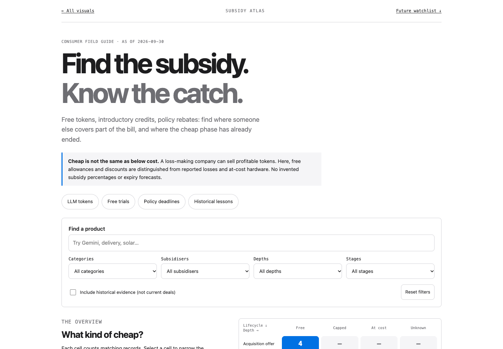
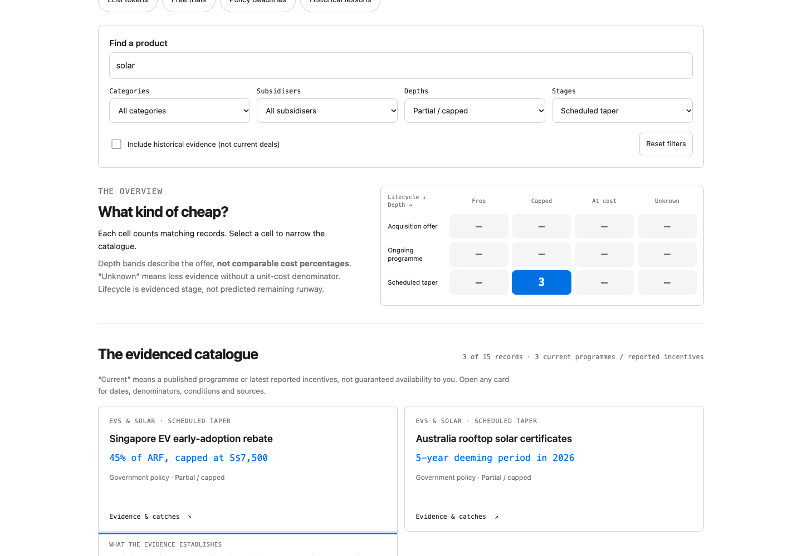
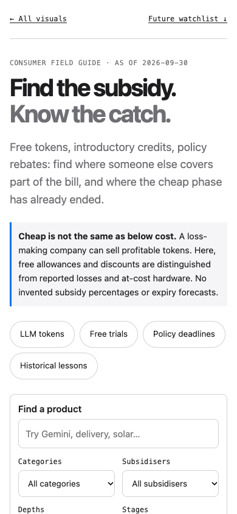
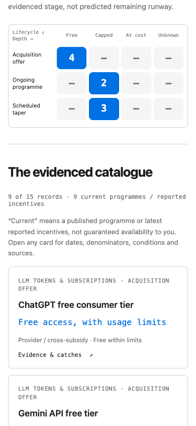
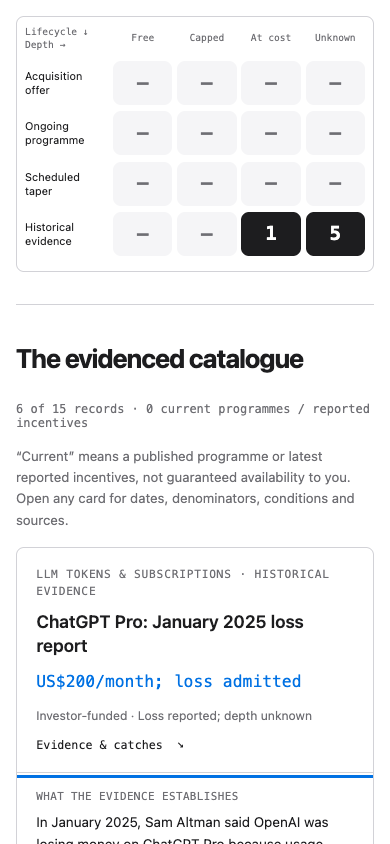

# Subsidy Atlas verification

As of 2026-09-30. Verified against the generated local site with
`chrome-devtools-axi`; no deployment performed.

## Stage A

```text
stage,check,status,evidence
A,data validation,PASS,scripts/validate.py: All data files valid
A,site build,PASS,scripts/build.py: 19 visualizations including subsidy-atlas
A,Python suite,PASS,101 tests; 120.227s
A,Node suite,PASS,24 tests including five Subsidy Atlas behavior tests
A,generated visualization,PASS,build.py --verify plus dataset reproducibility test
A,desktop browser,PASS,1440x1000; search and matrix drilldown; native keyboard expansion
A,phone browser,PASS,390x844 device emulation; 390px document width; nine default records
A,narrow phone,PASS,320px viewport; no horizontal overflow; empty results message
A,dark mode,PASS,390px viewport; dark tokens applied; no horizontal overflow
A,browser console,PASS,no errors
```

## Interaction evidence

- Default results: nine current programmes / reported incentives. Six
  historical records are hidden; three forecasts are a separate section.
- Search for `solar`: three matching policy records. Matrix drilldown sets
  depth to `partial` and stage to `tapering` and focuses the catalogue heading.
- Pressing Tab, then Enter from that heading focuses and expands the first
  result's native summary. The Singapore EV evidence, denominator and deadline
  are available without a pointer.
- The historical preset shows six records. Keyboard Enter expands the dated
  Pro loss report, with its current-profitability caveat and citations.
- Unmatched search shows zero cards and the empty-state recovery message.
  Reset restores default results. The watchlist separates agent trials,
  generative-video allowances and future solar support from catalogue evidence,
  with observed signals and reversal conditions. Node tests also verify conjunctive filters,
  both categories for the combined Grab record, invalid filter rejection,
  exact matrix totals and explicit speculation flags on retrieval.
- At 390px, enabled matrix cells are approximately 59 × 44px and the document
  width is 390px. At 320px the document does not overflow. Chrome's window
  resize alone had a 500px minimum, so phone checks used device emulation and
  confirmed `innerWidth`, not only the CLI's requested dimensions.

The mobile screenshot command reported a saved-path wrapper error, but wrote
valid 390 × 844 PNG files. Their dimensions and image contents were independently
read and checked; the screenshots below are the actual phone captures.

## Screenshots for the PR

Desktop overview / filters:



Desktop keyboard-opened policy evidence:



Phone landing page:



Phone overview / default results:



Phone historical evidence, opened with the keyboard:



## Scope and caveats

Sources and catalogue metadata are under `visuals/subsidy-atlas/` and
`data/visuals/subsidy-atlas.yaml`. Generated shared outputs were rebuilt after
rebasing onto the Tampines visualization's merged base; its source files were
not edited. Other generated page changes are the Published Corpus revision,
not unrelated content edits.

The overview deliberately uses descriptive depth bands and evidenced lifecycle
stages rather than an invented numerical cost-subsidy × predicted-duration
scatterplot. Several sources establish discounts, financing concessions or
segment losses, not negative marginal product costs. Historical records and
forecast judgements are labelled accordingly.
