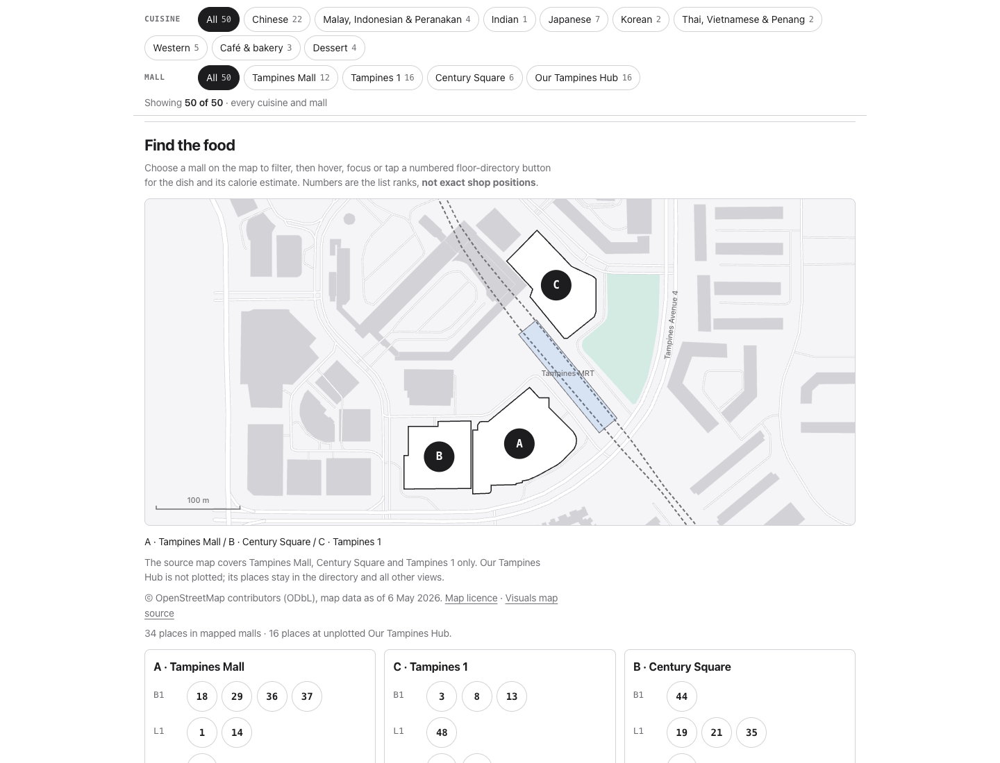
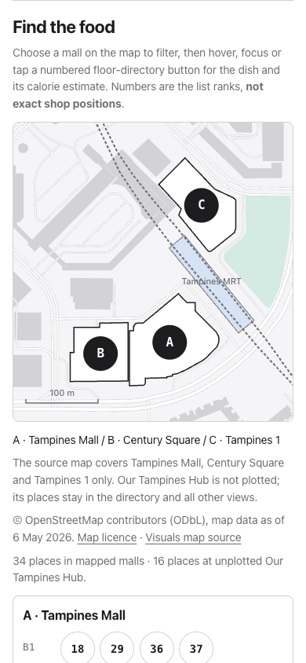
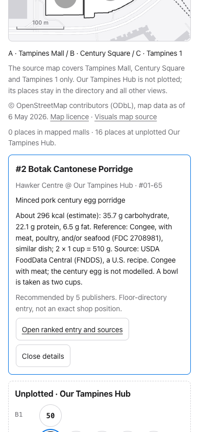

# Tampines food map: review evidence

The approved scope is **integration only**: add the Visuals map feature to **Good food in Tampines**. Separate-page publication is not required; no additional page or Visuals pin bump belongs to this change. Its filters still scope the ranked list, calorie chart and table. Numbered floor-directory buttons show the existing signature dish and nutrition estimate; their source link opens the original ranked entry.

## Source and limits

- Geometry comes unchanged from [the Visuals map at f02884d](https://github.com/yujieteo/visuals/blob/f02884d371523b9eed2a401b7e5515ee9e99ebae/viz/tampines-food-map/index.html), frozen in `visuals/tampines-food/map.json`.
- Map data: OpenStreetMap contributors, ODbL, 2026-05-06. Attribution, licence and source links appear on the page.
- That geometry covers **three malls**, containing 34 of the current 50 places. The 16 Our Tampines Hub entries remain filterable, with an explicitly unplotted floor directory. No Hub coordinate was added.
- Numbers are list ranks grouped by sourced unit/floor, not shop positions. All existing dataset fields, including ranking, sources and nutrition, are unchanged.
- This review changes source and generated assets only. Deployment and final live-site evidence belong to the outer delivery pipeline, not this review phase.

## Original checks (2026-09-30, before focus review fixes)

```text
stage,check,status,evidence
A,validation,PASS,scripts/validate.py: all data files valid
A,site build,PASS,scripts/build.py: only tampines-food generated assets changed
A,native builder,PASS,build.py --verify and repeat build produce identical output
A,Python suite,PASS,97 tests
A,Node suite,PASS,19 tests
A,dataset preservation,PASS,all fields except new map equal merged origin/main dataset
A,map preservation,PASS,geometry equals Visuals source; three malls only
A,desktop browser,PASS,1440x1100: 410 assertions plus keyboard activation and Escape
A,phone browser,PASS,390x844 touch emulation: 410 assertions plus keyboard activation and Escape
A,narrow dark browser,PASS,320x844 touch emulation: 410 assertions; no horizontal overflow
A,real pointer controls,PASS,SVG mall click filters to 12 places; rank hover shows original 893 kcal estimate
A,console and network,PASS,no console errors; page HTTP 200; no external map assets
A,diff hygiene,PASS,git diff --check
B,deployment,NOT RUN,review-only change
```

The browser checks exercise cuisine/mall combinations, empty mapped selections, all four mall directories, matching list/bar/table counts, estimates and not-estimable dishes, incompatible-selection clearing, original list/source navigation, calorie expansion and sort, and 44px directory targets. Phone details scroll into view after selection.

## Focus and metadata review fixes

Resize redraws only the map geometry, leaving directory buttons and detail actions intact and restoring the focused mall marker. Escape clears map details and hides tooltips, but restores directory focus only when the key event originates inside the map section. Focus outside that section stays where it is.

`scripts/verify_tampines_food_browser.js` now exercises width and height changes in both directions for every directory button, both detail actions and all mall markers. It checks Escape from map controls, calorie bars, filter chips, chart sorting and ranked entries, including real keyboard events. It also executes the registered `get_metadata` tool and compares its response with the pre-existing contract: geometry stays local to the map renderer and is not added to the metadata response.

Focused review verification passed at 1440×1100, 390×844 touch and 320×844 touch: 871 browser assertions per viewport, plus real marker activation, directory Escape, calorie-bar Escape with and without a map selection, and the executed WebMCP metadata contract. These checks ran against the regenerated native page.

Final delivery evidence must describe the enhanced native page, not claim publication of a second map page. No deployment was performed in this review phase.

### Reproduce the browser suite

After the normal build, serve the generated site:

```sh
python3 -m http.server 8744 --bind 127.0.0.1 --directory site
```

In another terminal:

```sh
export CHROME_DEVTOOLS_AXI_SESSION=tampines-map-review
chrome-devtools-axi open http://127.0.0.1:8744/visuals/tampines-food/
chrome-devtools-axi emulate --viewport '1440x1100x1' --color-scheme light
chrome-devtools-axi run < scripts/verify_tampines_food_browser.js
chrome-devtools-axi emulate --viewport '390x844x1,mobile,touch' --color-scheme light
chrome-devtools-axi run < scripts/verify_tampines_food_browser.js
chrome-devtools-axi emulate --viewport '320x844x1,mobile,touch' --color-scheme dark
chrome-devtools-axi run < scripts/verify_tampines_food_browser.js
```

## Screenshots

### Desktop map and floor directories



### Phone map



### Phone: Our Tampines Hub selection


